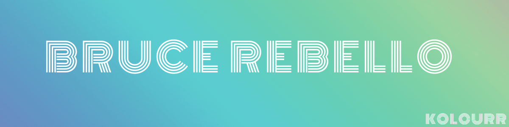

### Hi there 👋

Hi! I'm Bruce Rebello, a Software and Industrial Engineer specializing in Solid.js, Angular, Go (Golang), Python, Typescript, JavaScript, Bash Scripting, PostgreSQL, EJS, React, Node, MongoDB, OOP, Stripe, New Relic, Azure, AWS, Linux, HTML, CSS, Tailwind CSS, Bootstrap and Daisy UI. I love learning, reading and building things that have a positive impact on the world. In my free time, I make Indie-Pop music as the artist Kolourr.

- 🔨 I currently work as a software engineer for the Blue Innovations Group in Pinellas Park, Florida helping build the infotainment system for the R-30 electric boat.
- 📫 How to reach me **bruce.rebello@gmail.com**
  - Resume: [Resume](https://www.kolourr.com/static/resume.pdf)
  - Website: [Kolourr.com](https://www.kolourr.com)

### 📈 Github Stats

  <table>
      <tr>
        <td width="50%">
          <h3 align="center">Basic Metrics</h3>
          >
        </td>
        <td width="50%">
          <h3 align="center">Recent Coding Habits</h3>
          
        </td>
      </tr>
       <tr>
        <td width="50%">
          <h3 align="center">👨‍💻 Lines of Code changed</h3>
          >
        </td>
        <td width="50%">
          <h3 align="center">🌟 Recently Starred Repositories</h3>
          
        </td>
      </tr>
  </table>
