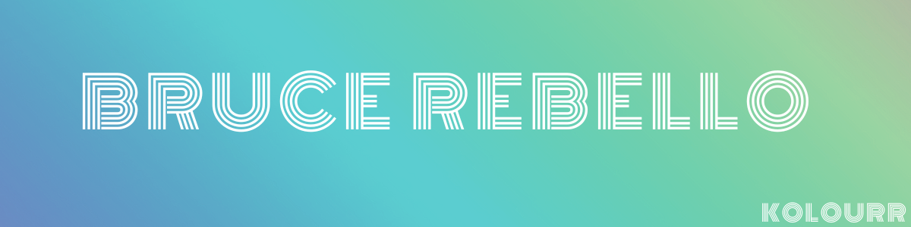

### Hi 👋

I'm Bruce Rebello, an Industrial & Software Engineer. I'm currently building:

- [Midpoint](https://www.cardcenteringtool.com)
- [Vidulk](https://www.vidulk.com)
- [Makeup Check AI](https://www.makeupcheckai.com)
- [Maxx Report](https://www.looksmaxxreport.com)
- [Blindspot](https://www.whatdomyfriendsthinkofme.com)
- [Trimm](https://www.trimm-app.com/)
- [Rash Detector](https://www.rashdetector.com)

and paused work on  [Commonly Odd](https://www.commonlyodd.com) at I Lov Guitars Inc. (my 1 person startup). Previously, I worked as a software engineer at [Blue Innovations Group](https://blueinnovationsgroup.com/) helping build their infotainment system in Go and Solid-Js.

I love learning, reading and building things that have a positive impact on the world. In my free time, I make Indie-Pop music as the artist Kolourr.

- 📫 How to reach me **bruce.rebello@gmail.com**
- Resume: [Resume](https://www.kolourr.com/static/resume-bruce.pdf)
- Website: [Kolourr.com](https://www.kolourr.com)

### 📈 Github Stats

  <table>
      <tr>
        <td width="50%">
          <h3 align="center">Basic Metrics</h3>
          >
        </td>
        <td width="50%">
          <h3 align="center">Recent Coding Habits</h3>
          
        </td>
      </tr>
       <tr>
        <td width="50%">
          <h3 align="center">👨‍💻 Lines of Code changed</h3>
          >
        </td>
        <td width="50%">
          <h3 align="center">🌟 Recently Starred Repositories</h3>
          
        </td>
      </tr>
  </table>
